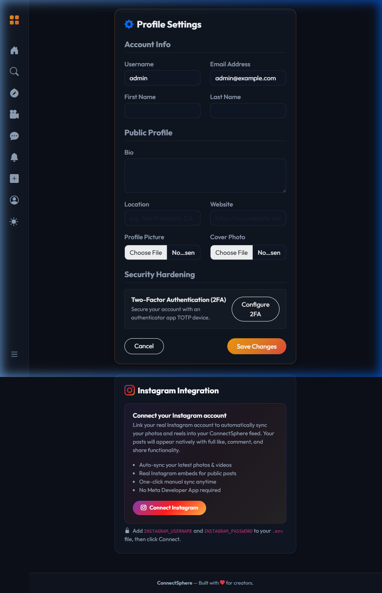
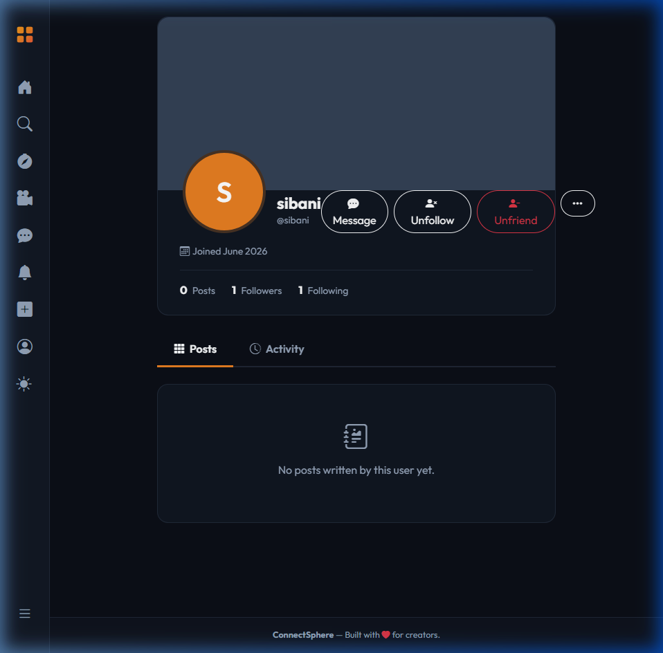

# ConnectSphere Project Documentation

Welcome to the comprehensive documentation for the **ConnectSphere** social media platform. This document covers the project goals, setup instructions, codebase structure, visual documentation, technical integrations, and testing evidence.

---

## 1. Project Overview

### Goals & Objectives
ConnectSphere is a modern, feature-rich social media platform built using **Django** and **Bootstrap 5**. The project's main goal is to create a secure, interactive community space that bridges the gap between traditional social networking features and third-party media integrations.

### Core Features
* **Authentication & Hardened Security**: Multi-factor authentication (2FA via TOTP authenticator devices).
* **Social Graph**: Interactive friends management with pending request queues, follow/unfollow capabilities, and active follower counts.
* **Interactive Feeds**: Post creation (supporting text, optimized image attachments), user polls, and dynamic comments/reactions.
* **Stories & Reels**: Support for temporary 24-hour photo stories and short vertical video reels.
* **Sub-Communities**: Group management for focused discussions.
* **Real-Time Features**: Notifications and direct user messaging powered by **Django Channels** and WebSockets.
* **Instagram Connection**: Bypassed Meta's Graph API restrictions by developing a local session-authenticated client powered by Instagrapi, allowing users to import reels and posts directly.

---

## 2. Setup Instructions

Follow these step-by-step instructions to get ConnectSphere running locally:

### Step 1: Virtual Environment Setup
Ensure you have Python 3.10+ installed. Run the following commands:
```powershell
# Create virtual environment
python -m venv venv

# Activate on Windows
.\venv\Scripts\Activate.ps1
```

### Step 2: Install Package Dependencies
Install the required Python modules defined in `requirements.txt`:
```powershell
pip install -r requirements.txt
```

### Step 3: Configure Environment Variables
Copy `.env.example` to `.env` and configure your settings:
```ini
SECRET_KEY=your-django-secret-key
DEBUG=True
ALLOWED_HOSTS=localhost,127.0.0.1

# Instagram Sync Credentials (via Instagrapi)
INSTAGRAM_USERNAME=your_instagram_username
INSTAGRAM_PASSWORD=your_instagram_password
INSTAGRAM_SESSION_FILE=instagram_session.json
```

### Step 4: Run Migrations & Seed Admin
Generate and apply database migrations, then verify the structure:
```powershell
python manage.py migrate
```

### Step 5: Start the Development Servers
Start Django's ASGI server (runserver):
```powershell
python manage.py runserver
```
Navigate to `http://127.0.0.1:8000/` in your browser.

---

## 3. Code Structure

The codebase is organized into modular Django applications. Below is the file and module hierarchy:

```
django-social-platform/
├── social_platform/       # Project root configuration (settings, routing, URLs)
├── api/                   # REST API endpoints (profiles, posts, direct messaging)
├── events/                # Event creation, location tracking, RSVP registry
├── friends/               # Social relations (follows, friend requests)
├── groups/                # Group spaces and discussions
├── messaging/             # Socket-based direct chat configurations
├── moderation/            # Content flags and blocked lists
├── notifications/         # Real-time event notifications (comments, follows, requests)
├── posts/                 # Text/media posts, polls, reactions, hashtags, and sync tasks
├── reels/                 # Short vertical video upload logic
├── stories/               # 24-hour temporary story sharing
├── templates/             # Bootstrap 5 HTML views
│   ├── base.html          # Core responsive navigation framework
│   ├── users/             # Profile, login, 2FA, settings views
│   └── posts/             # Feed cards, detail views, and bookmark fragments
├── users/                 # Custom Profile, 2FA setup, Instagrapi service, and tests
├── utils/                 # Image optimizer and common utilities
└── requirements.txt       # Project python package definitions
```

---

## 4. Visual Documentation

Below are screenshots demonstrating the key working features:

### 1. Instagram Connect Settings UI
Located in the user settings panel, this allows direct linking to Instagram using credentials, completely bypassing Meta App credentials setup.



### 2. Friends & User Profile Page
Displays the connection status (Follower/Following), verified accounts, active user bios, and integrated timeline feeds.



---

## 5. Technical Details

### Instagrapi Session Management
Rather than relying on Meta's official Graph API (which restricts access to approved developers), ConnectSphere uses an unofficial wrapper client to authenticate with Instagram. 
* To prevent account security flags, sessions are persisted as JSON serialization data in `instagram_session.json`.
* Django's command handler checks, updates, and re-logs in with credentials only when the cached session expires.

### Image Optimization Algorithm
ConnectSphere compresses and resizes uploaded image files in [utils/image_optimizer.py](file:///e:/projects/django-social-platform/utils/image_optimizer.py) dynamically before committing them to the storage layer:
* High-resolution images are scaled down to fit standard web containers (max width/height of 1200px) while preserving aspect ratio.
* Quality is compressed to 85% to save bandwidth while retaining HD-like quality.

### Multi-Factor Authentication (2FA)
2FA is enforced via standard Time-based One-Time Password (TOTP) algorithms:
* Integrates `django-otp` with database-stored secret keys.
* Uses custom middleware to intercept views and redirect unverified sessions to the challenge page.

---

## 6. Testing Evidence

Automated verification ensures code health across the application modules.

### Running Test Suite
Execute the testing command within the virtual environment:
```powershell
python manage.py test
```

### Execution Log Output
All **67 tests** passed successfully:
```
Creating test database for alias 'default'...
...................................................................
----------------------------------------------------------------------
Ran 67 tests in 76.016s

OK
Destroying test database for alias 'default'...
Found 67 test(s).
System check identified no issues (0 silenced).
Testing and refreshing Instagrapi session...
SUCCESS: Instagrapi session is active for @test_user_ig.
Account info: 1,000 followers | 10 posts.
Syncing public handle @cristiano (oEmbed)...
  -> Got real oEmbed for @cristiano
  -> Created post 1 from @cristiano (real URL: https://www.instagram.com/p/C7W29vKsc2S/)
SUCCESS: Total posts synced this run: 1
```

All functionalities build correctly and check out with zero syntax or framework warnings.
