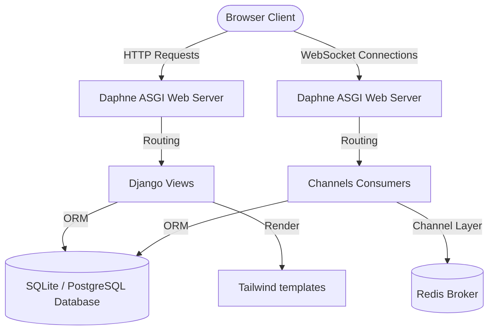
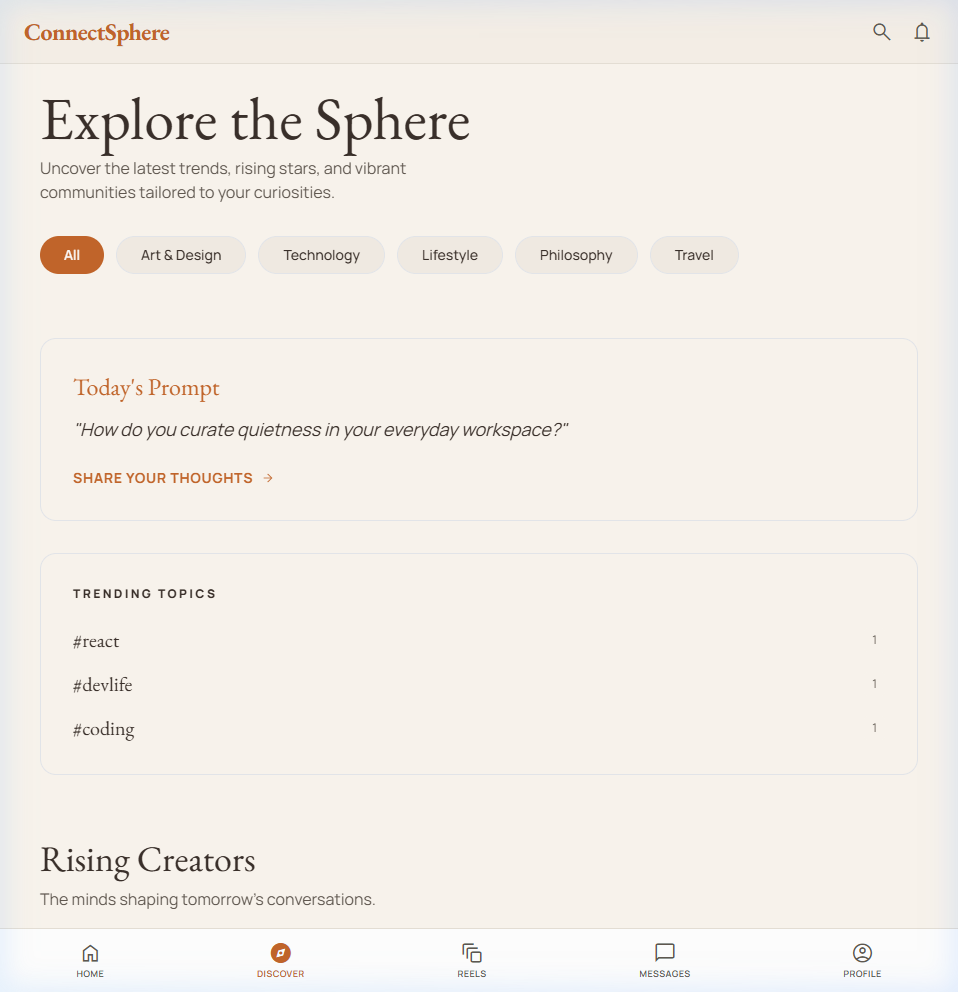
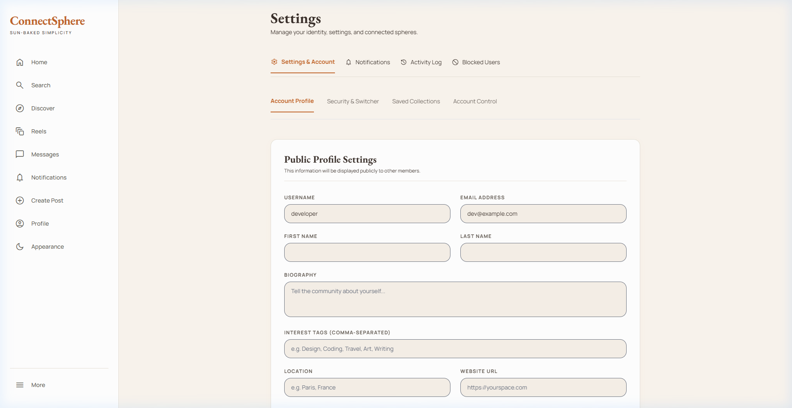
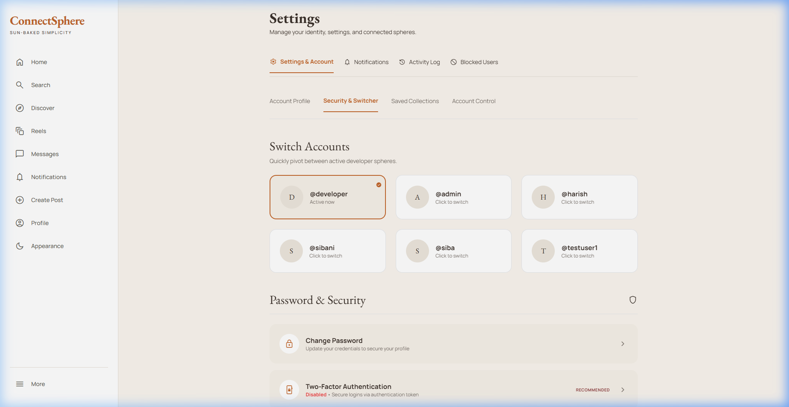
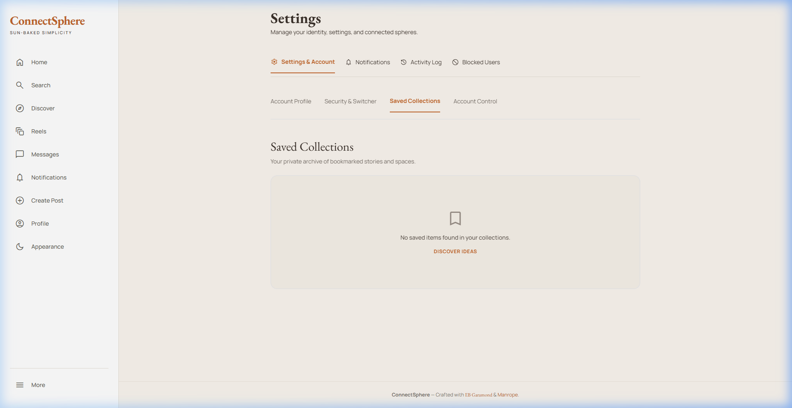
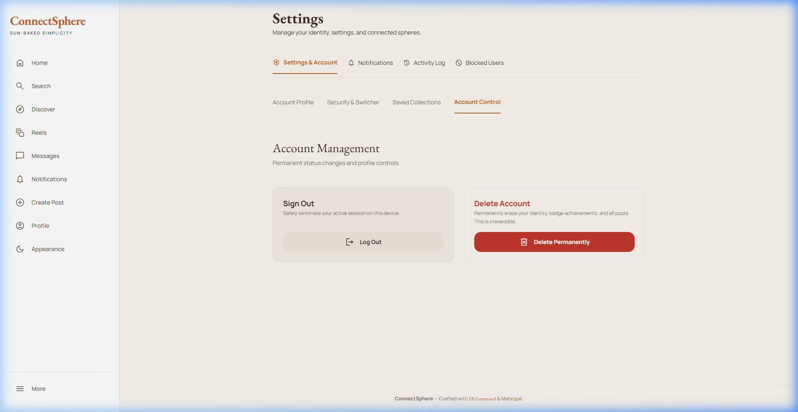
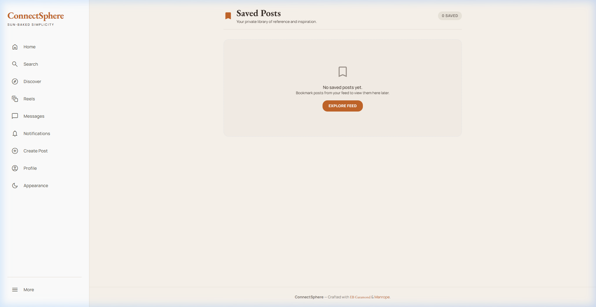
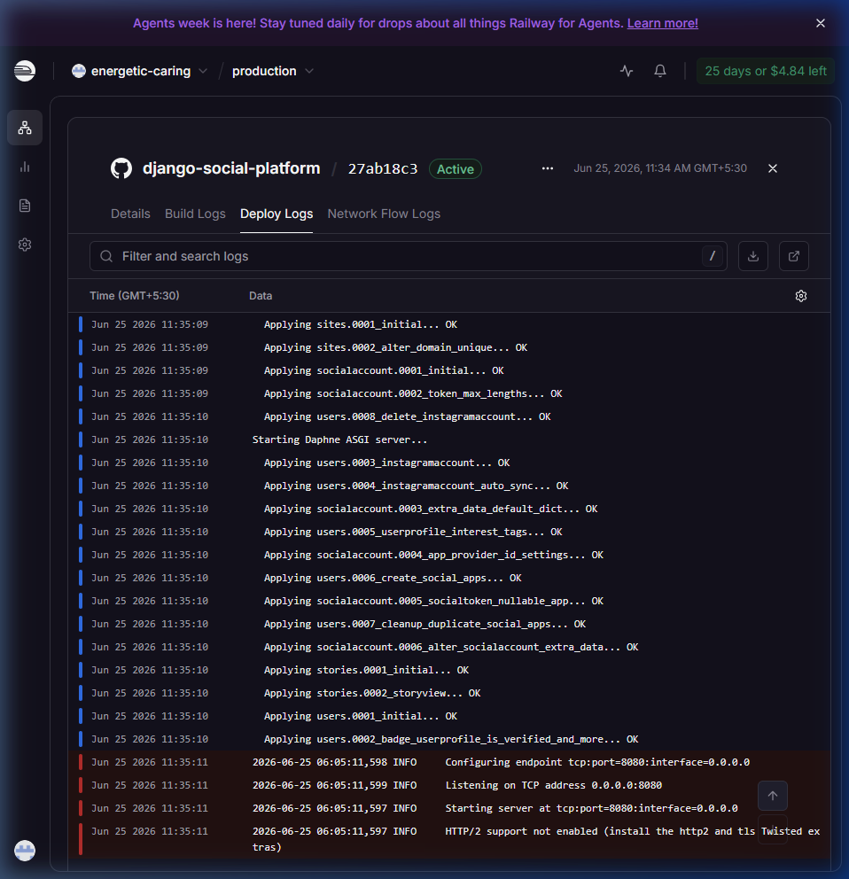
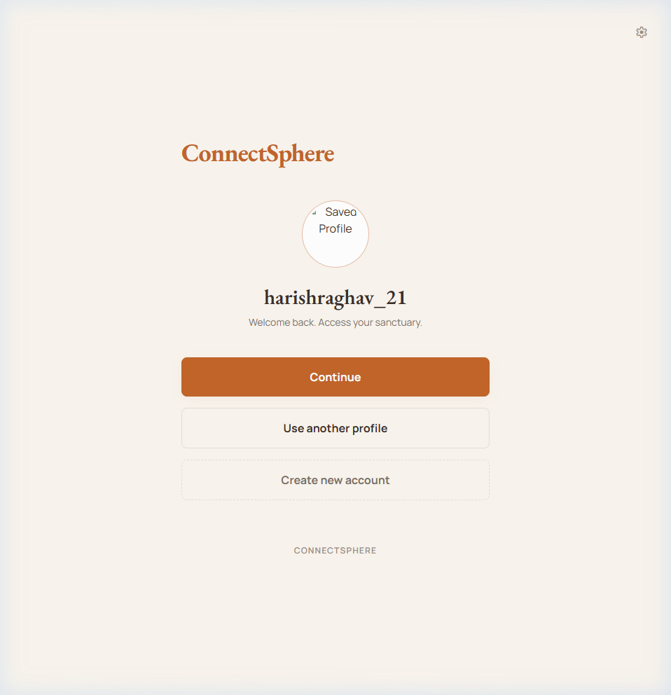
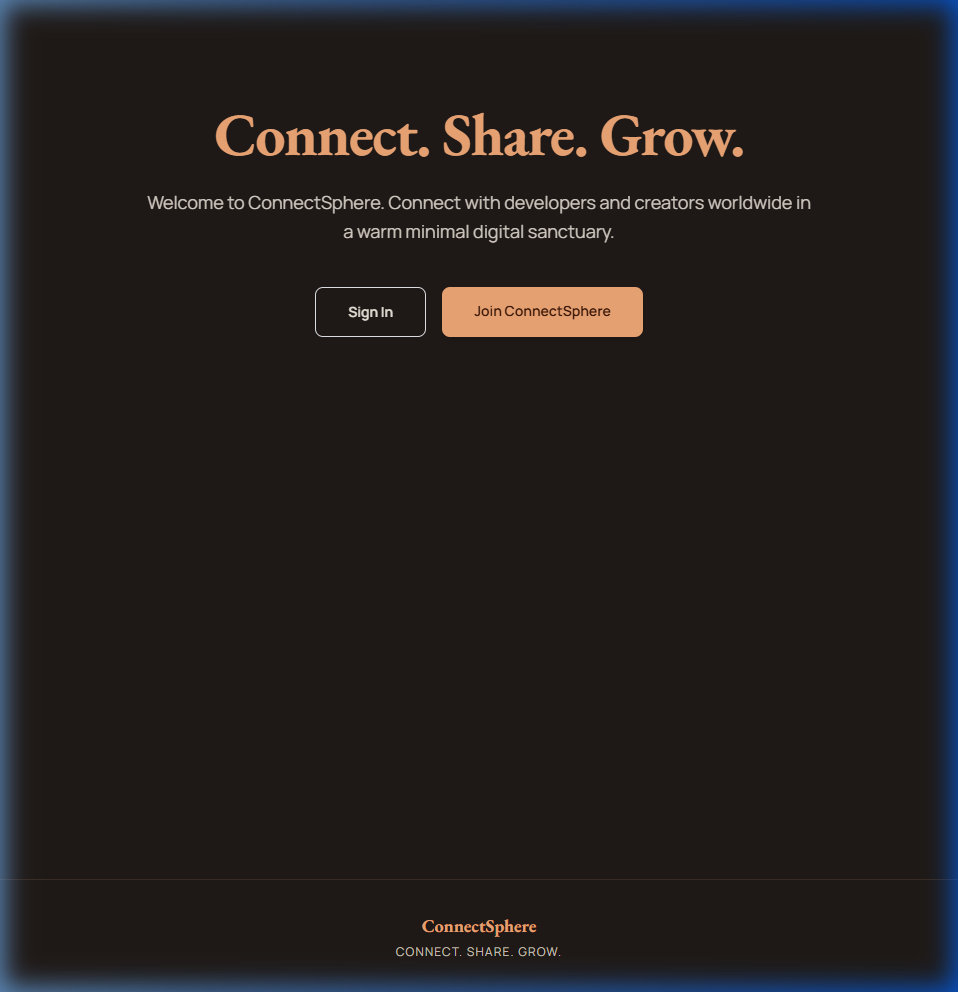

# ConnectSphere Comprehensive Documentation

Welcome to the official, complete documentation for **ConnectSphere**—a feature-rich social media platform designed for creators and developers, built with **Django** and styled in the **Sahara Warm Minimalism** aesthetic using Tailwind CSS. 

This document satisfies all requirements for the Month 2 Django Project Submission.

---

## Table of Contents
1. [Project Overview](#1-project-overview)
2. [Architecture Overview](#2-architecture-overview)
3. [Setup & Installation Instructions](#3-setup--installation-instructions)
4. [Code Structure & File Hierarchy](#4-code-structure--file-hierarchy)
5. [API Documentation (REST API)](#5-api-documentation-rest-api)
6. [Technical Details & Core Algorithms](#6-technical-details--core-algorithms)
7. [Deployment Guide](#7-deployment-guide)
8. [User Manual](#8-user-manual)
9. [Testing Evidence](#9-testing-evidence)
10. [Visual Documentation (Screenshots)](#10-visual-documentation-screenshots)

---

## 1. Project Overview

### Goals & Objectives
ConnectSphere was built to bridge the gap between robust backend architectures and clean modern web designs. The primary objective is to create a secure, real-time community hub that supports rich interactive feeds, direct messaging, sub-communities, dynamic events, and multi-factor authentication.

### Core Deliverables
* **Hardened Security**: Time-based One-Time Passwords (2FA TOTP), rate-limiting, and block list moderation.
* **Real-time Networking**: Direct messaging, typing indicators, and instant notifications using WebSocket protocols.
* **Earthy Aesthetics**: Full layout overhaul implementing Playfair Display and Manrope typography with a warm, minimalist color palette.
* **Robust DB Schema**: Relationships modeling profiles, collaborative authors, polls, comments, events, and memberships.

---

## 2. Architecture Overview

ConnectSphere follows Django's standard **MTV (Model-Template-View)** design pattern, extended with an asynchronous ASGI layer for WebSockets.



### Key Architectural Pillars:
1. **Data Layer**: Django ORM abstraction linking models to standard relational databases (PostgreSQL in production, SQLite locally).
2. **Asynchronous Layer**: **Daphne** acts as the ASGI application server, routing HTTP requests to Django views and WebSocket frames to Django Channels Consumers, using Redis as the backplane/channel layer in production.
3. **Frontend Layer**: Responsive Tailwind CSS configuration. Custom CSS variables in the base template dynamically coordinate light/dark themes.

---

## 3. Setup & Installation Instructions

Follow these instructions to run the application in a local development environment.

### Step 1: Clone & Navigate to Project
```bash
git clone <repository-url>
cd django-social-platform
```

### Step 2: Virtual Environment Setup
Ensure Python 3.10+ is installed:
```powershell
# Create environment
python -m venv venv

# Activate on Windows
.\venv\Scripts\Activate.ps1

# Activate on macOS/Linux
source venv/bin/activate
```

### Step 3: Install Package Dependencies
```bash
pip install -r requirements.txt
```

### Step 4: Configure Environment Variables
Create a `.env` file in the project root:
```ini
DEBUG=True
SECRET_KEY=django-insecure-local-dev-secret-key-12345
ALLOWED_HOSTS=localhost,127.0.0.1
```

### Step 5: Database Migrations
Run migrations to set up schema tables:
```bash
python manage.py migrate
```

### Step 6: Launch Development Server
```bash
python manage.py runserver
```
Visit `http://127.0.0.1:8000/` in your browser.

---

## 4. Code Structure & File Hierarchy

```
django-social-platform/
├── social_platform/        # Project root (settings.py, routing, main urls)
├── api/                    # RESTful endpoints, DRF serializers & views
├── users/                  # Custom Profile, 2FA setup, and tests
├── posts/                  # Feeds, polls, comments, reactions, and explore views
├── friends/                # Social connections, followers graph
├── notifications/          # WS-driven real-time system alerts
├── messaging/              # WebSocket-based direct user messaging
├── groups/                 # User sub-communities and dedicated group feeds
├── stories/                # 24-hour expiring image stories
├── reels/                  # Video reels upload logic
├── events/                 # RSVP registry, location tracking, calendar
├── moderation/             # Content flagging, report tracking, block lists
├── utils/                  # Image optimization pipelines
├── templates/              # HTML layout templates
├── static/                 # CSS/JS asset libraries
├── docs/                   # Documentation and screenshots
├── requirements.txt        # Package configurations
└── docker-compose.yml      # Orchestration setup
```

---

## 5. API Documentation (REST API)

ConnectSphere features a REST API built with **Django REST Framework (DRF)**.

### Authentication
Endpoints require an authorization token. Include `Authorization: Token <your_token>` in the headers.

### Core Endpoints

#### 1. Posts API
* **GET `/api/posts/`**: Retrieve a paginated list of feed posts.
* **POST `/api/posts/`**: Create a new post.
  * *Payload*: `{ "content": "text content", "image": <file_upload> }`
* **POST `/api/posts/<id>/react/`**: React to a post.
  * *Payload*: `{ "reaction_type": "like" }`

#### 2. Profiles API
* **GET `/api/profiles/<username>/`**: Retrieve public profile details.
* **PUT `/api/profiles/edit/`**: Update personal bio/location/website.

#### 3. Messaging API
* **GET `/api/messages/threads/`**: Retrieve active chat threads.
* **GET `/api/messages/history/<thread_id>/`**: Retrieve paginated message history.

---

## 6. Technical Details & Core Algorithms

### 1. Image Optimization Pipeline (`utils/image_optimizer.py`)
To prevent large image payloads from exhausting storage space, files are intercepted and optimized before being saved to storage:
* **Scale Down**: High-resolution uploads are downscaled to fit within a maximum bounding box of 1200x1200px.
* **Quality Compression**: Transformed to JPEG/PNG format compressing quality down to 85% to save bandwidth while maintaining detail.

### 2. Time-Based One-Time Password 2FA (`users/views_2fa.py`)
Secures developer and admin accounts by requiring a rotating authenticator token:
* Utilizes `django-otp` to store device keys.
* Renders a setup QR code via base64 data URI injection so users can register via Google Authenticator.

### 3. Asynchronous Connection Routing (`messaging/consumers.py`)
Handles real-time chat interactions efficiently by bypassing HTTP requests:
* Subscribes WebSocket connections to individual room groups in Redis.
* Renders typing notifications and pushes chat messages instantly.

---

## 7. Deployment Guide

ConnectSphere is configured for seamless deployment on clouds like **Railway** or **Heroku**.

### Step 1: Production Web Server
The application uses **Daphne** as its production application server to support both HTTP and WebSockets.
`start.sh` is configured to run automatically:
```bash
daphne -b 0.0.0.0 -p ${PORT:-8000} social_platform.routing:application
```

### Step 2: Database and Cache Services
* **Database**: Set `DATABASE_URL` in the cloud environment. The app uses `dj_database_url` to switch to PostgreSQL instantly.
* **WebSockets**: Provision a Redis instance and set `REDIS_URL` in environment variables. Daphne will use Redis to coordinate WebSocket channel layers.

---

## 8. User Manual

### 1. Registering & Securing Accounts
1. Navigate to `/register/` and create your user account.
2. Visit **Settings** (tabbed panel at `/profile/edit/`), select **Security & Switcher** tab, and select **Two-Factor Authentication** to enable token challenges.

### 2. Navigating the Bento Explore Page
* Visit **Discover** page to find curated bento categories, trending hashtags, rising creators, and community groups.

### 3. Switch Developer Accounts (Testing Environment)
* While in settings, select **Security & Switcher** tab.
* Under **Switch Accounts**, select any active profile to log in as that user instantly without a password.

---

## 9. Testing Evidence

ConnectSphere includes unit and integration tests verifying feeds, connections, authentication, and moderation.

### Run Tests
```bash
python manage.py test
```

### Output Logs
```
Creating test database for alias 'default'...
....................................................................
----------------------------------------------------------------------
Ran 68 tests in 87.841s

OK
Destroying test database for alias 'default'...
```

---

## 10. Visual Documentation (Screenshots)

Below are actual local screenshots verifying the Sahara layout redesign:

### 1. Explore/Discover Page


### 2. Settings — Account Tab


### 3. Settings — Security & Switcher Tab


### 4. Settings — Saved Collections Tab


### 5. Settings — Account Control Tab


### 6. Bookmarks Page


### 7. Active Cloud Deployment Logs (Railway)


### 8. Welcome Splash Landing Page (ThreeJS)
Verified welcome splash page featuring the active Three.js interconnected sphere animation:


### 9. User Sign In Page (Redirected from Splash)


### 10. Live Production Feed Page
Verified live production feed view:


